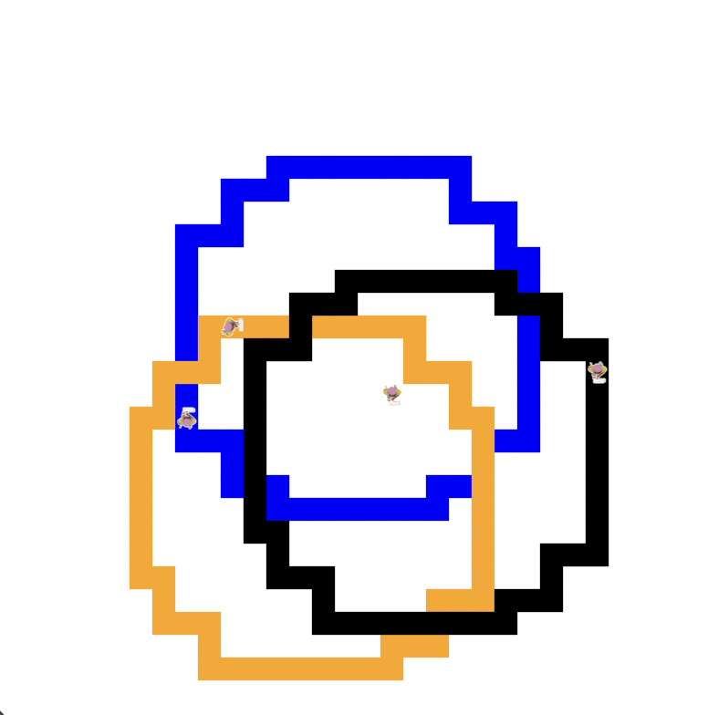

# AsphaltArt
This is my asphalt art project, Navneet Singh, it is a optical illusion inspired by the olympic logo in code.org.

# Unit 1 - Asphalt Art

## Introduction

Cities use asphalt art to improve public safety, inspire their residents and visitors, and brighten communities. Your goal is to create asphalt art to revitalize The Neighborhood and bring the community together with the help of the Painter.

## Requirements

Use your knowledge of object-oriented programming, algorithms, the problem solving process, and decomposition strategies to create asphalt art:
- **Create a new subclass** – Create at least one new subclass of the PainterPlus class that is used for a component of the asphalt art design.
- **Plan an algorithm** – Use the problem solving process and decomposition strategies to plan an algorithm that incorporates a combination of sequencing, selection, and/or iteration.
- **Write a method** – Write at least one method in a PainterPlus subclass that contributes to a component of the asphalt art design.
- **Document your code** – Use comments to explain the purpose of the methods and code segments.

## Notes: Neighborhood & Painter Class

This project was created on Code.org's JavaLab platform using the built-in Neighborhood GUI output. To test and edit this project you must build in Code.org's JavaLab with the Neighborhood GUI enabled. For reference to the Painter class documentation, [you can read more here.](https://studio.code.org/docs/ide/javalab/classes/Painter)

## Output:

## Reflection

1. Describe your project.

My project was an optical illusion goal with inspiration from the olympic logo on a 32x 32 grid. It was a fun way for me to explore loops and condiitons and create specific algorithims.

2. What are two things about your project that you are proud of?

I am proud I worked in a 32x32 grid as it is very hard to do so with a design and I am proud I was able to use subclasses efficiently in this project than I do often.

3. Describe something you would improve or do differently if you had an opportunity to change something about your project.

I would change the way I had wrote my code, I feel like I could have used methods more than they were used in this project, for example, my reset to center was used once and never again so I could have used it for my other painters of different rings.

4. How is this project related to STEAM (Science, Technology, Engineering, Art, and Mathematics)? Provide explicit examples from the project and details as possible. 

This was related to technology and arts because we had to use technology like code.org to code painters to make a desired design, for example, for me it was a optical illusion, and I had to use code like methods such as outline to create this design I wanted which is an art design. 

5. What SLOs did you demonstrate during completing this project?

A SLO I demonstrated was problem solving because I ran into errors while desigining this project, for example, the painter would go another way or go off grid than what I expected, so I had to test multiple times and fix code until I got it right.